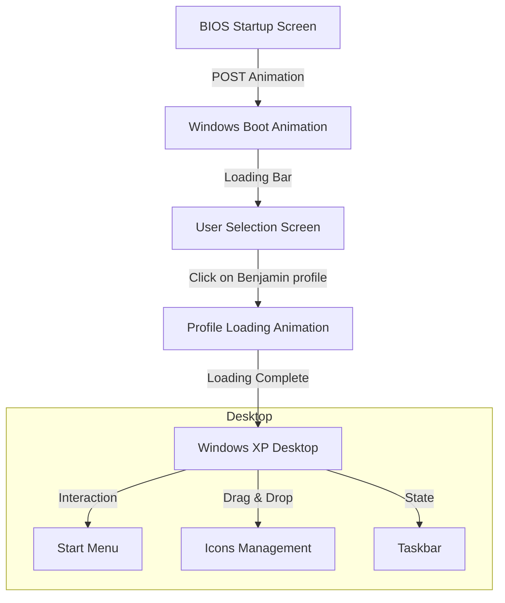
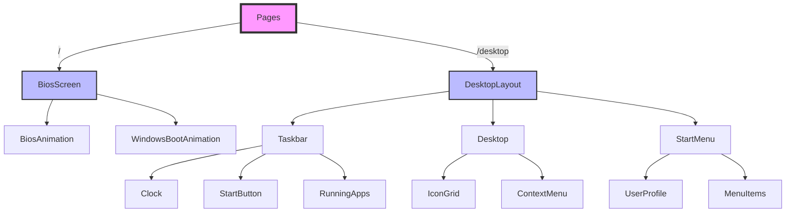

# Windows XP Clone - Project Documentation

## 1. Overview
This project aims to create a faithful replica of the Windows XP interface using modern web technologies. The project includes the complete startup experience, from BIOS to the Windows XP desktop.

## 2. User Flow
The following diagram illustrates the user journey from system startup to desktop access:



## 3. Component Architecture
The following diagram shows the component structure of the application:



## 4. Technical Stack
### Core
- Next.js 15
- React 19
- Tailwind CSS
- Shadcn/ui
- Supabase

### Recommended Additional Libraries
- `react-dnd`: For icon drag and drop functionality
- `framer-motion`: For smooth animations
- `zustand`: For global state management
- `howler.js`: For Windows XP sound effects

## 5. Technical Prerequisites

### 5.1 Required Assets
- Windows XP system images (logo, buttons, icons)
- Windows XP system sounds
- System fonts (Tahoma, Microsoft Sans Serif)
- Windows XP cursors

### 5.2 Key Features to Implement
- Startup animations
- Window system
- Drag & drop icon management
- Context menu (right-click)
- Interactive taskbar
- Start menu

## 6. Architecture

### 6.1 Folder Structure
```
app/
├── _components/
│   ├── assets/
│   │   └── sample-icon.tsx
│   ├── layout/
│   ├── ui/
│   │   ├── button.tsx
│   │   └── badge.tsx
│   └── widgets/
│       ├── boot/
│       │   ├── bios.tsx
│       │   └── windows.tsx
│       └── desktop/
│           ├── Desktop.tsx
│           ├── Taskbar.tsx
│           └── StartMenu.tsx
├── _constants/
│   ├── config.ts
│   └── routes.ts
├── _hooks/
│   ├── useWindowSystem.ts
│   └── useDesktopState.ts
├── _types/
├── _utils/
│   ├── supabase/
│   └── windows-utils/
├── globals.css (global style)
├── page.tsx (BIOS screen)
└── desktop/
    └── page.tsx (Windows desktop)
```

## 7. Execution Plan

### Phase 1: Setup & Foundation
- Next.js project configuration
- Dependencies installation
- Basic structure creation
- Required assets collection
- Global styling system setup

### Phase 2: Boot Sequence
- BIOS animation
- Windows XP startup screen
- User login screen
- Transitions and animations

### Phase 3: Desktop Interface
- Desktop implementation
- Icon drag & drop system
- Functional taskbar
- Basic start menu

### Phase 4: Advanced Features
- Context menu
- System sounds
- Resizable windows
- Animation enhancements

### Phase 5: Polish
- Compatibility testing
- Performance optimization
- Bug fixes
- Documentation

## 8. Important Considerations

### Performance
- Implement lazy loading for components
- Optimize animations to prevent slowdowns
- Efficient media asset management

### Compatibility
- Ensure cross-browser compatibility
- Adapt interface for different resolutions
- Handle touch events for mobile devices

### Accessibility
- Implement keyboard navigation
- Add appropriate ARIA attributes
- Support screen readers

## 9. Future Enhancement Suggestions

- Add classic Windows XP applications (Paint, Notepad)
- Virtual file system
- Advanced window management
- Alternative Windows XP themes
- Fullscreen mode
- Desktop state saving

## 10. Success Metrics

- Visual fidelity to Windows XP
- Performance (loading time < 3s)
- Animation smoothness (60 FPS)
- Lighthouse score > 90
- Modern browser support